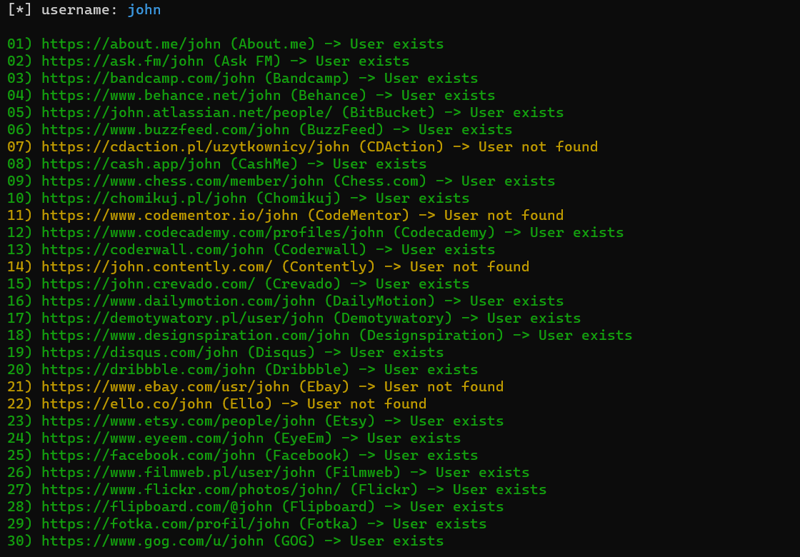

# namecheck
module for checking if user exist


## install
```cmd
python -m venv venv
# on windows
.\venv\Scripts\Activate.ps1
# on linux
source venv/bin/activate

git clone https://github.com/streanger/namecheck.git
cd namecheck
pip install -r requirements.txt
# or
pip install aiohttp requests termcolor pyperclip
```

If running on linux type this command for clipboard feature

```
sudo apt-get install xclip
```

## usage 
```cmd
# terminal output
python namecheck.py <username>
python namecheck.py <username> --csv
```

```
# gui output
python namecheck_gui.py
```
- to open url use mouse left button double click
- or mouse middle button single click on chosen label
- use rightclick and `copy`, to copy url to clipboard

## screenshots



