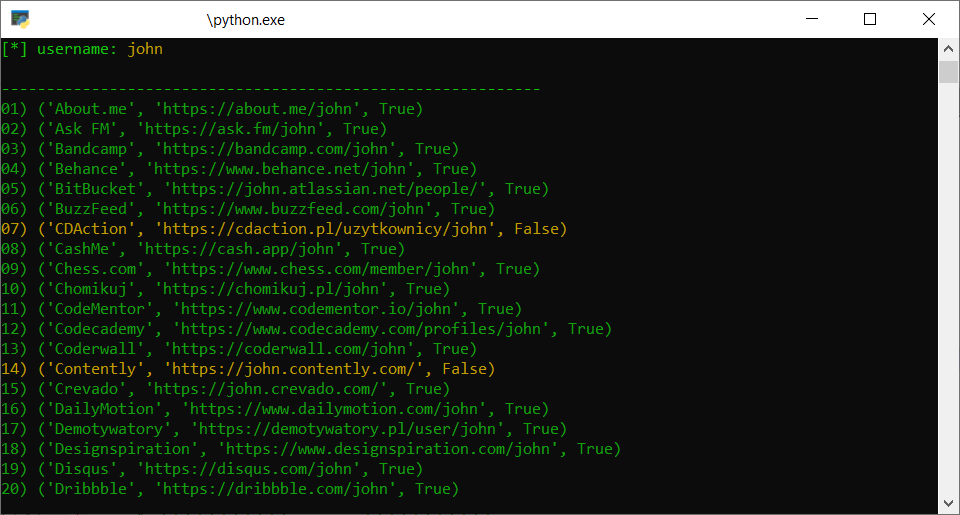

# namecheck
module for checking if user exist


## install
```cmd
git clone https://github.com/streanger/namecheck.git
cd namecheck
pip install -r requirements.txt
# or
pip install aiohttp requests termcolor
```

## usage 
```cmd
# terminal output
python namecheck.py <username>

# gui output
python namecheck_gui.py <username>
# to open url use mouse left button double click
# or mouse middle button single click on chosen label 
```

## screenshots



